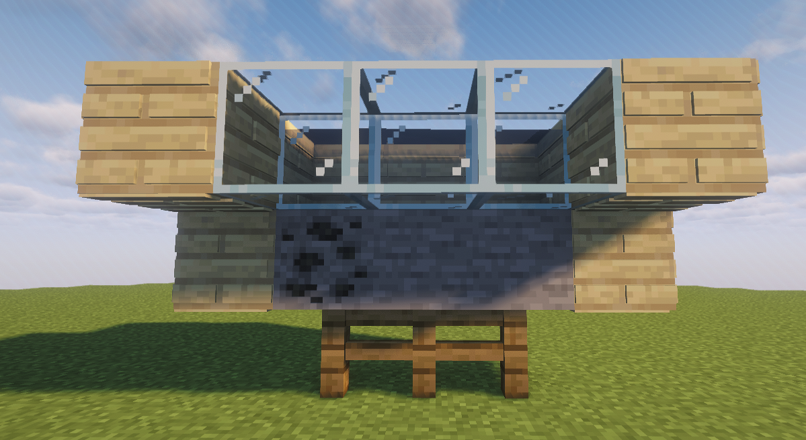

# 💎 무한광산

울타리 위에 **한 칸을 비운 뒤**, 그 **한 칸 위에 물을 설치하면 무한 광산이 생성됩니다.**

<figure><figcaption></figcaption></figure>

무한 광산에서는 일반 광물과 특수광물을 얻을 수 있으며, 채굴한 자원은 판매하여 돈을 벌거나 강화석 제작에 활용할 수 있습니다.

### 특수광물

<figure><figcaption></figcaption></figure>

월장석, 토파즈, 지르콘, 페리도트, 아쿠아마린, 투어멀린, 사파이어, 루비
