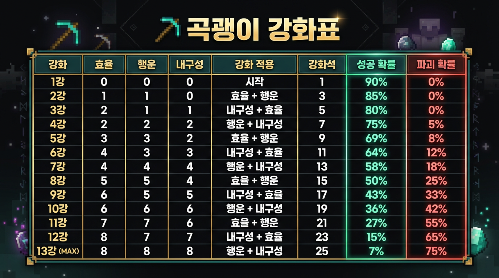
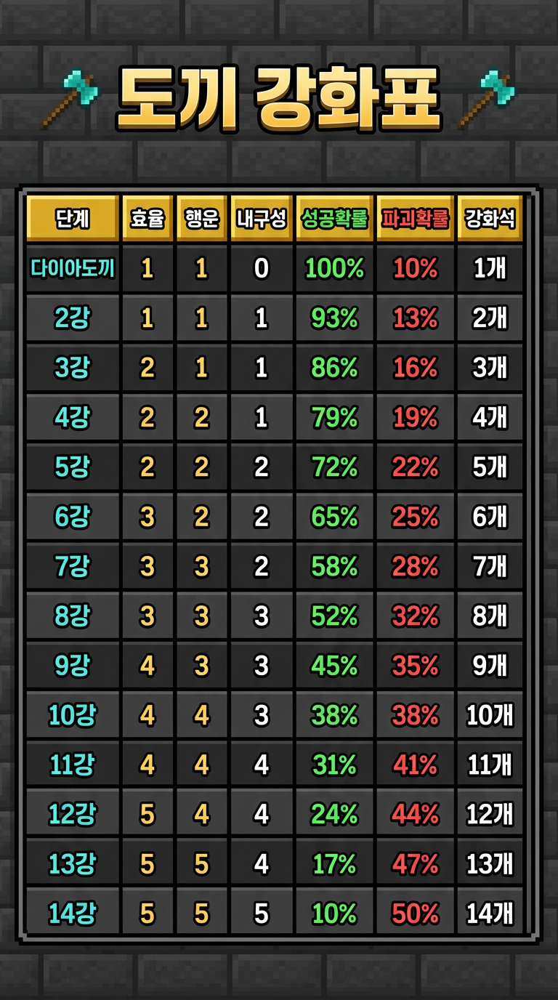
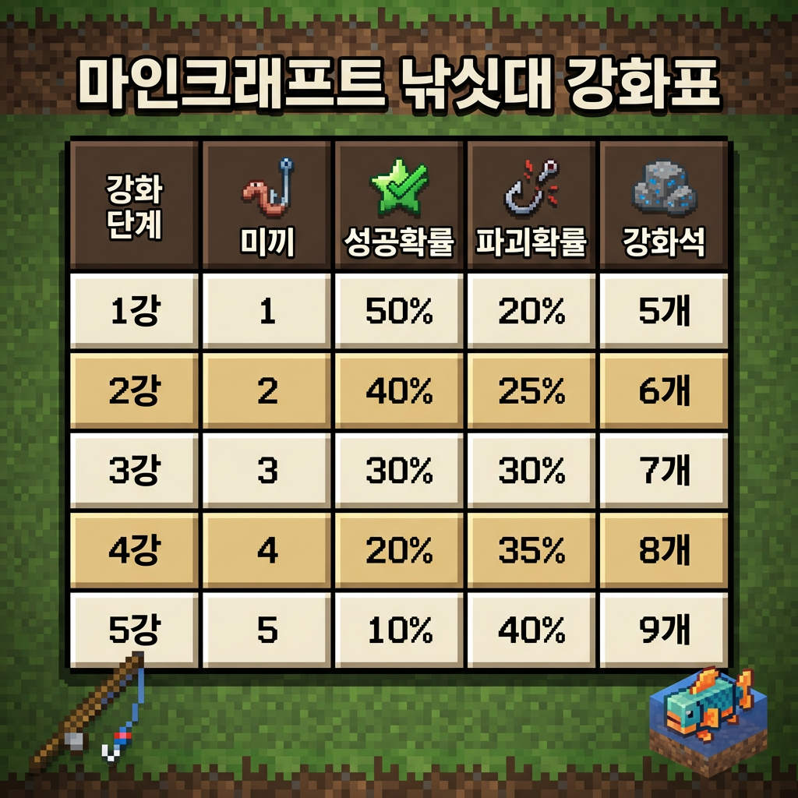
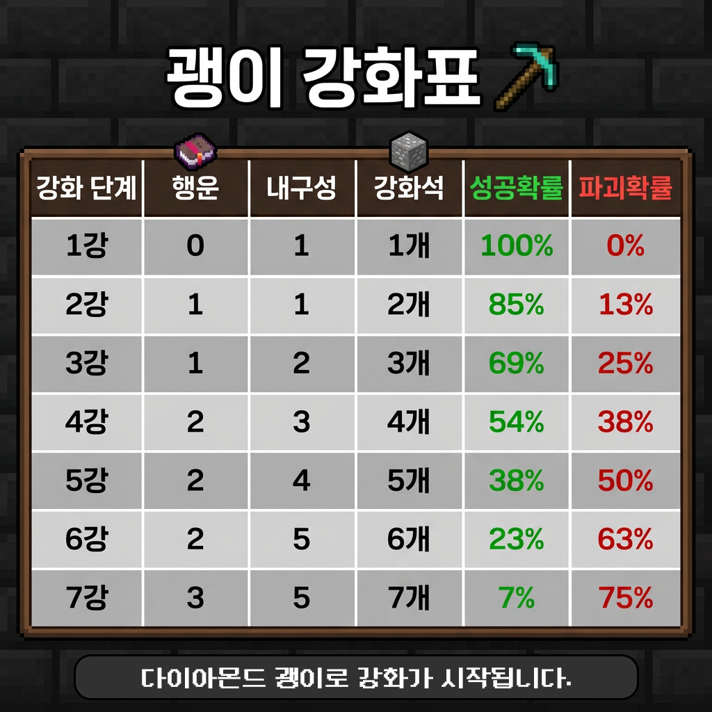

# 🔧 강화 시스템

### ⚒️ 어떤 도구를 강화할 수 있나요?

현재 강화가 가능한 도구는 아래와 같습니다.

<table><thead><tr><th width="270">강화 가능 도구</th><th>설명</th></tr></thead><tbody><tr><td><strong>낚싯대</strong></td><td>낚시 콘텐츠를 더욱 효율적으로 즐길 수 있습니다.</td></tr><tr><td><strong>곡괭이</strong></td><td>광물 채집과 채굴 효율을 높일 수 있습니다.</td></tr><tr><td><strong>도끼</strong></td><td>벌목 및 관련 작업에서 더 좋은 성능을 기대할 수 있습니다.</td></tr><tr><td><strong>괭이</strong></td><td>농사와 작물 관리에 더욱 효율적으로 사용할 수 있습니다.</td></tr></tbody></table>

***

### ✨ 강화를 하면 무엇이 좋아지나요?

도구를 강화하면 각종 인챈트 효과가 부여되어 기본 도구보다 훨씬 뛰어난 성능을 사용할 수 있습니다.

강화가 진행될수록\
더 좋은 옵션과 효과를 기대할 수 있으며, 각 생활 콘텐츠를 보다 효율적으로 진행할 수 있습니다.

즉, 강화 시스템은 단순한 옵션 추가가 아니라\
**생활 콘텐츠의 효율을 높여주는 성장 요소**라고 볼 수 있습니다.

***

### 📈 강화는 왜 중요한가요?

강화된 도구는 기본 도구보다 더 뛰어난 성능을 가지기 때문에\
낚시, 채굴, 벌목 같은 생활 콘텐츠를 훨씬 편하게 진행할 수 있습니다.

예를 들어,

* 낚싯대를 강화해 더 좋은 낚시 효율을 기대할 수 있고
* 곡괭이를 강화해 채굴 효율을 높일 수 있으며
* 도끼를 강화해 벌목 작업을 더 수월하게 진행할 수 있습니다

따라서 강화 시스템은\
생활 콘텐츠를 오래 즐길수록 더욱 중요한 역할을 하게 됩니다.

***

### 🛠️ 강화는 어떻게 하나요?

강화는 **강화창에 필요한 아이템을 맞게 넣은 뒤**, **강화 버튼을 눌러 진행**할 수 있습니다.

강화에 필요한 재료와 도구는 강화표 또는 강화창 안내에 맞게 넣어주시면 되며,\
조건이 맞는 상태에서 버튼을 누르면 강화가 진행됩니다.

<figure><figcaption></figcaption></figure>

#### 곡괭이 강화

<figure><figcaption></figcaption></figure>

#### 도끼 강화

<figure><figcaption></figcaption></figure>

#### 낚싯대 강화

<figure><figcaption></figcaption></figure>

### **괭이**

<figure><figcaption></figcaption></figure>

> 📌 강화 시에는 반드시 사진(강화표)에 맞는 아이템을 올바르게 넣어야 합니다.

***

### 📌 간단 정리

* **낚싯대, 곡괭이, 도끼**를 강화할 수 있습니다.
* 강화를 하면 각종 인챈트가 붙어 더 좋은 도구가 됩니다.
* 강화는 생활 콘텐츠 효율을 높이는 중요한 성장 요소입니다.
* 자세한 강화 단계는 아래 **강화표 이미지**를 참고해주세요.
